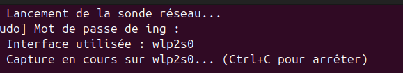
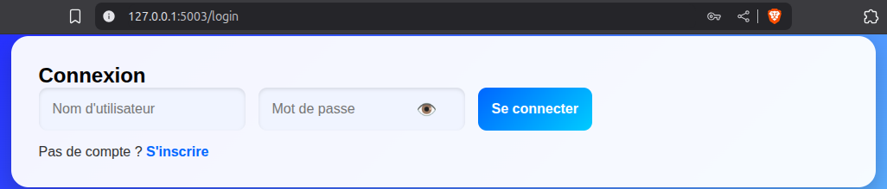
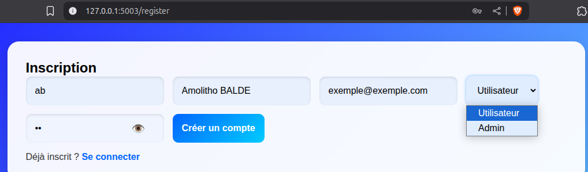
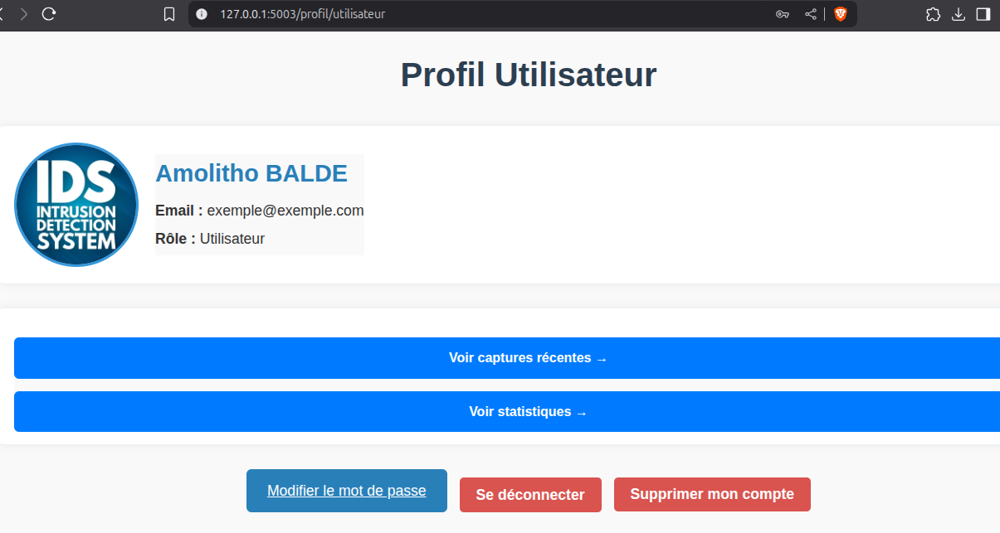
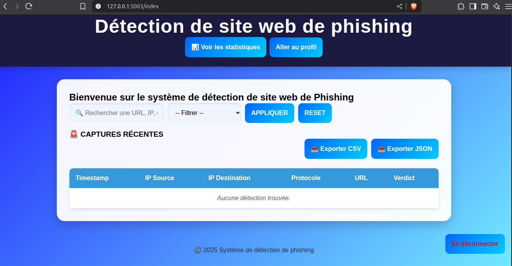
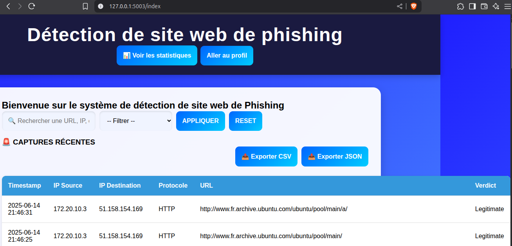
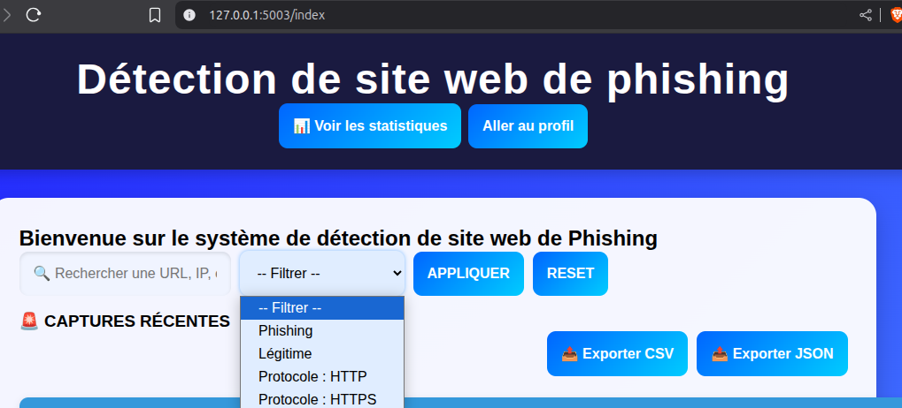
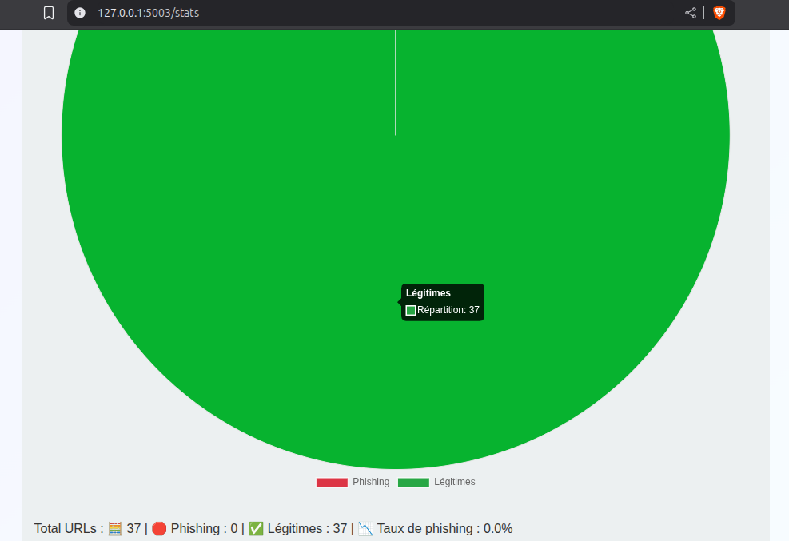
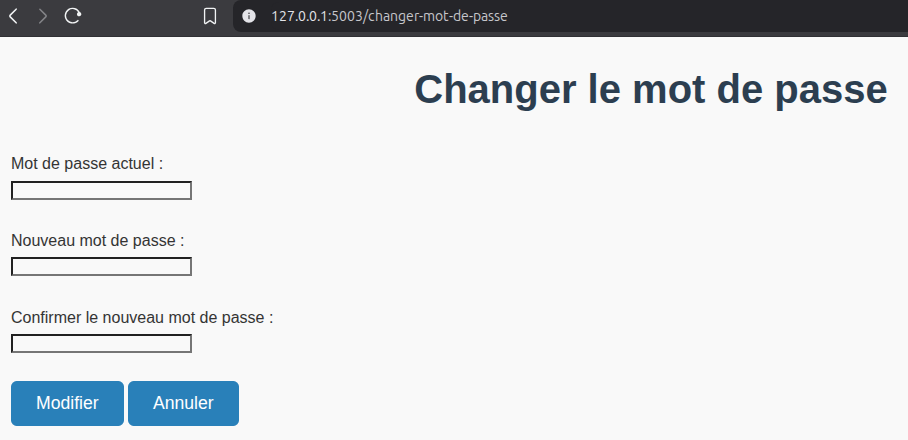
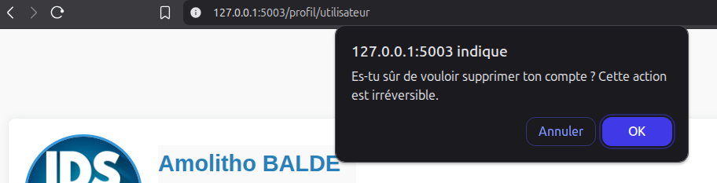

# 🛡️ Détéction de site web légitime ou non 
> _Un système complet pour capturer des URLs HTTP, extraire des caractéristiques, et détecter des tentatives de phishing en temps réel grâce à l'apprentissage automatique._  

> Résumé : Quelqu'un va sur un site web utilisant http, on lui dit via notre interface web si ce site web est légitime ou non. Cette classification est faite via l'apprentissage automatique
---
## 🧭 Table des matières

- [📸 Démo](#démo)
- [🚀 Fonctionnalités principales](#fonctionnalités-principales)
- [📦 Technologies utilisées](#technologies-utilisées)
- [📁 Structure du projet](#structure-du-projet)
- [🛠️ Installation](#installation)
- [▶️ Utilisation](#utilisation)
- [📈 Perspectives](#perspectives)
---

## Démo
**a. Lancement du projet**

Pour démarrer le projet, il faut d’abord se positionner dans le répertoire qui contient tous les fichiers nécessaires. Une fois à cet endroit, on exécute le script launch_all.sh.
Dès qu’on lance ce script, trois terminaux s’ouvrent automatiquement. L’un d’eux nous invite à entrer notre mot de passe, car la sonde réseau utilise sudo pour capturer les paquets – c’est une étape indispensable au bon fonctionnement du système.


L’interface active est détectée et utilisée automatiquement si elle n’était pas précisée lors du lancement du script.

**b. Accès à l’interface web**
Une fois le script lancé, on peut se rendre dans le terminal qui exécute l'application Flask. Un lien est affiché, basé sur l’adresse locale 127.0.0.1:5003. On peut simplement faire Ctrl + clic droit sur le lien puis l’ouvrir l’interface dans le navigateur.
On atterrit alors sur la page de connexion.


**c. Connexion ou création de compte**
À partir de cette page, deux choix s’offrent à nous :
Se connecter, si on possède déjà un compte.
Créer un compte, si on est nouveau.
Lorsqu’on choisit de s’inscrire, plusieurs informations sont demandées : nom utilisateur, adresse électronique, nom complet, rôle (utilisateur ou administrateur), etc.


**À noter** : pour l’instant, seul le rôle d’utilisateur est pris en charge. La gestion d’administrateur fait partie des évolutions futures du projet.
Une fois le formulaire rempli, on clique sur Créer un compte. Cette action nous redirige automatiquement vers la page de connexion.

**d. Navigation après connexion**
Quand on se connecte, on est alors dirigé vers la page profil utilisateur.
Cette page affiche différentes informations, telles que : le nom d’utilisateur, l’e-mail,le rôle attribué, ainsi que plusieurs boutons d’action : Voir les captures récentes, voir les statistiques des détections (notamment la répartition entre trafic légitime et phishing),
On a aussi d’autres options : 
- Modifier le mot de passe,
- Supprimer le compte,
- ou tout simplement Se déconnecter.


**e. Capture récente**
Depuis le profil utilisateur, on peut cliquer sur Capture récente. Comme le compte vient d’être créé, il est normal qu’aucune capture ne soit encore affichée.


Pour faire des captures et le résultat de la classification par le modèle ML, trois méthodes s’offrent à nous :
- Faire un CURL vers un site : **curl example.com**.
- Utiliser un WGET, pour télécharger la page web : **wget google.com**
- Passer par le navigateur, en ouvrant une URL HTTP.

Une fois les captures disponibles, elles s’affichent dans l’interface web. 



**f. Filtrage**
Plusieurs options permettent de filtrer les résultats :
- Par le verdict, pour distinguer phishing ou légitime,
- Par protocole, HTTP, HTTPS, SMTP, etc.
- Par recherche d’adresse IP, URL, ou même un préfixe d’adresse IP.

Par ailleurs, deux boutons permettent d’exporter les données affichées au format CSV ou JSON.

**g. Consulter des statistiques**
Un diagramme circulaire illustre la répartition entre URL phishing (en rouge) et légitime (en vert). Juste en dessous, le taux de phishing est indiqué en pourcentage.



**h. Modifier son mot de passe ou supprimer son compte**
Enfin, depuis le profil, il est possible de modifier le mot de passe, de supprimer le compte (avec un message d’alerte rappelant que cette action est irréversible), ou de se déconnecter.




---

## Fonctionnalités principales
Ce projet propose un **système complet de détection de phishing en temps réel** basé sur :
- 📡 Capture des paquets HTTP en temps réel avec Scapy
- 🧠 Extraction automatique de 13+ caractéristiques d'URL (IP, longueur, entropie, etc.)
- 🤖 Classification intelligente (phishing vs légitime) avec un modèle ML
- 🌐 **API Flask** pour intégrer la prédiction dans n’importe quel outil (pour interagir avec le modèle)
- 📊 Interface web **web de monitoring** avec logs et statistiques
- 🧾 **Base de données SQLite** pour conserver les détections (date, IP, protocole, verdict)

---

## Technologies utilisées

| Type        | Technologie                      |
|-------------|----------------------------------|
| Langage     | Python 3.11                      |
| Capture     | Scapy                            |
| Machine Learning | TensorFlow, scikit-learn    |
| Données     | pandas, re, urllib               |
| API         | Flask                            |
| Base de données | SQLite                       |
| Web         | HTML / CSS / JS                  |

---

## Structure du projet
```bash
phishing-detection-ml/
│
├── 📁 data/                     # Contient les jeux de données bruts et prétraités
│   ├── url_dataset.xlsx                 # Jeu de données original avec URLs (phishing et légitimes)
│   ├── http_url_dataset.csv            # Version filtrée ne contenant que les URLs en HTTP
│   └── features_phishing_dataset.csv   # Jeu de données avec les caractéristiques extraites (features)
│
├── 📁 model/                    # Scripts pour entraîner, charger, et utiliser le modèle ML
│   ├── __init__.py                       # Fichier d’initialisation du module
│   ├── model_handler.py                 # Fonctions pour gérer le modèle (chargement, prédiction, etc.)
│   └── phishing_model.h5                # Modèle de détection de phishing préentraîné (Keras/TensorFlow)
│
├── 📁 network_capture/          # Scripts pour la capture réseau en temps réel (via Scapy)
│   ├── __init__.py                       # Fichier d’initialisation du module
│   ├── http_url_sniffer.py             # Capture les URLs HTTP transitant sur le réseau local
│   └── captRequest.py                  # Récupère, traite et prépare les requêtes sniffées pour analyse
│
├── 📁 api/                      # API Flask servant d’interface entre Scapy/Web et le modèle ML
│   ├── __init__.py                       # Fichier d’initialisation
│   └── receptFlask.py                  # API REST qui reçoit les URLs et renvoie la prédiction
│
├── 📁 web/                      # Interface web pour interagir avec l’utilisateur
│   ├── __init__.py                       # Initialisation du module web
│   ├── app.py                           # Lance l’application web (probablement Flask ou Django intégré)
│   └── templates/                       # Fichiers HTML pour les pages web
│       ├── changer_mot_de_passe.html       # Page de changement de mot de passe
│       ├── index.html                      # Page d'accueil
│       ├── login.html                      # Page de connexion
│       ├── profile_admin.html              # Interface de l’administrateur
│       ├── profile_user.html               # Interface de l’utilisateur standard
│       ├── register.html                   # Formulaire d'inscription
│       └── stats.html                      # Page de statistiques (prédictions, trafic, etc.)
│   └── static/                          # Fichiers statiques (CSS, images, JS...)
│       ├── style.css                      # Style global
│       ├── profile_user.css               # Style de la page utilisateur
│       └── profile_admin.css              # Style de la page administrateur
│
├── 📁 utils/                    # Fonctions utilitaires pour automatiser le traitement
│   ├── __init__.py                       # Initialisation du module
│   ├── convert_https_to_http.py         # Convertit les URLs HTTPS vers HTTP (utile pour sniffing)
│   ├── extract_features_from_http_dataset_csv.py  # Extrait les caractéristiques des URLs d’un CSV HTTP
│   ├── extract_features_from_one_url.py           # Extrait les caractéristiques d’une seule URL
│   ├── find_path.py                      # Trouve dynamiquement les chemins relatifs vers les fichiers
│   ├── load_data.py                      # Charge les datasets dans des formats utilisables (Pandas, etc.)
│   └──  send_url.py                       # Envoie une URL à l’API Flask pour analyse
│ 
├── 📁 database/                 # 🗄Scripts et base de données pour la gestion des utilisateurs
│   ├── __init__.py                       # Initialisation
│   ├── database.py                      # Gère la base SQLite (création, accès, requêtes)
│   └── users.db                         # Base de données SQLite générée automatiquement si absente
│
├── .gitignore                  # Fichiers et dossiers à ignorer par Git (comme .db, __pycache__, etc.)
├── launch_all.sh              # Script shell pour tout lancer automatiquement (API, sniffing, web)
├── README.md                  # Documentation complète du projet : objectif, installation, démo
└── requirements.txt           # Dépendances Python à installer avec `pip install -r requirements.txt`
```

## Installation

```bash
# 1. Cloner le repo
git clone https://github.com/Bamolitho/phishing-detection-ml.git
cd phishing-detection-ml

# 2. Créer un environnement virtuel
python3 -m venv venv
source venv/bin/activate  # ou .\venv\Scripts\activate sur Windows

# 3. Installer les dépendances
pip install -r requirements.txt
```

## Utilisation
```bash
# 1. Se placer dans le dossier du projet, phishing-detection-ml.
cd chemin_vers_phishing-detection-ml

# 2. Ajouter des privilèges d'exécution pour l'utilisateur
sudo chmod +x launch_all.sh

# 3. Pour lancer les 3 composantes (Modèle ML, la sonde, l'app flask contenant les fonctionnalités essentielles pour l'interface web)
./launch_all.sh ou bash launch_all.sh

# 4. Ouvrir un navigateur pour accéder à l'interface web via l'adresse suivante
http://localhost:5003/login
```
## Perspectives
1. Développer d'autres modèles d'apprentissage automatique, tels que : Random Forest, Decision Tree, LLM, etc.
  
2. Compléter les aspects liés à la gestion administrative : finaliser le profil administrateur, avec des fonctionnalités comme :
 - la gestion des usagers,
 - une vue d'ensemble sur tout ce qui se passe sur les réseaux, etc.
   
3. Prendre en compte d'autres protocoles : tels que HTTPS, SMTP, SMTPS, IMAP, IMAPS, etc.

4. Implémenter un système d’alerte en temps réel
- Notifications par email ou interface web en cas de détection de phishing,
- Ajout d’une priorité ou d’un niveau de menace.

5. Enrichir la base de données avec des métadonnées
- Heure précise de détection, durée de la connexion, nom d’hôte, etc.
- Cela permettrait des analyses plus poussées.

6. Développer une API REST sécurisée : Pour permettre à d’autres outils ou systèmes de consulter ou d’envoyer des données.

7. Intégrer une interface graphique plus avancée (avec dashboard) : Classement des utilisateurs selon l’activité ou la menace détectée.

8. Mettre en place une sandbox ou une zone de test : Pour rejouer des paquets suspects ou entraîner des modèles de manière isolée.

9. Ajout de l’apprentissage en ligne (online learning) : Le modèle s’améliore en continu à partir des nouvelles détections.

10. Déploiement multi-machines (architecture distribuée) : Plusieurs sondes installées sur des machines différentes, toutes connectées à un serveur central.

11. Détection de spoofing et d’attaques réseau spécifiques (ex : MITM, ARP Poisoning) : Étendre la portée à d’autres types de menaces, pas seulement le phishing.

12. Journalisation avancée et audit : Garder une trace complète de toutes les actions du système pour des audits de sécurité.

13. Mode entraînement utilisateur : Simuler des tentatives de phishing pour tester la vigilance des utilisateurs et les sensibiliser.

